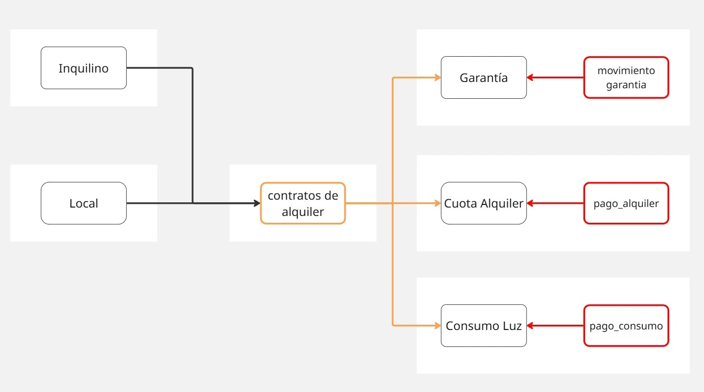

## inquilino

```ts
	 id
	 nombre
	 telefono
	 email
	 documento  // DNI
	 fecha_registro
	 estado  // activo|inactivo

```

--
## local

```ts
	 id
	 nombre  // nombre de local
	 descripcion
	 area  // metros cuadrados del local
	 estado  // libre|ocupado|mantenimiento

```

## contrato

```ts
	inquilino_id  // clave foranea de inquilino
	local_id  // clave foranea de local
	precio_mensual
	garantia
	fecha_creacion
	fecha_inicio
	fecha_fin
	observaciones
	estado  // activo|finalizado|renovado|cerrado

```

## garantia

```ts
	id
	contrato_id  // clave foranea de contrato
	monto_inicial  // monto inical de garantia
	monto_actual  // saldo restante de la garantia
	fecha_registro
	fecha_cierre
	observaciones
	estado  // retenida|devuelta|consumida

```

## cuota_alquiler

```ts
	id
	contrato_id  // clave foranea de contrato
	fecha_inicio
	fecha_vencimiento
	fecha_pago  // fecha que se paga el total del monto de alquiler
	monto
	monto_pagado  // en caso de pagos fraccionados +0 = monto
	estado  // pendiente|activo|atrasado|parcial|pagado

```

## consumo_luz

```ts
	id
	contrato_id  // clave foranea de contrato
	fecha_inicio  // fecha de inicio del medido
	fecha_fin  // fecha del dia medido
	fecha_pago  // fecha que se paga el total del monto de alquiler
	lectura_anterior
	lectura_actual
	precio_kwh
	consumo_kwh_total
	alumbrado_publico
	monto  // monto total del consumo a cobrar
	monto_pagado  // en caso de pagos fraccionados +0 = monto
	estado  // activo|atrasado|parcial|pagado

```

## movimiento_garantia

```ts
	id
	contrato_id
	fecha_registro
	monto
	metodo_pago  // efectivo|transferencia|deposito
	referencia  // url de foto o identificador de pago
	tipo_accion  // deposito|devuelta|consumida
	observaciones

```

## pago_alquiler

```ts
	id
	cuota_alquiler_id
	monto
	metodo_pago  // efectivo|transferencia|deposito
	referencia  // url de foto o identificador de pago
	fecha_registro
	observaciones

```

## pago_consumo

```ts
	id
	contrato_id
	monto
	metodo_pago  // efectivo|transferencia|deposito
	referencia  // url de foto o identificador de pago
	fecha_registro
	observaciones
 
```

